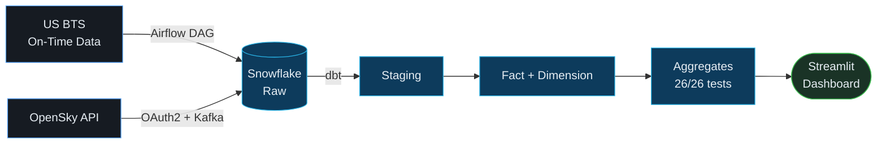

<div align="center">
  
</div>

<div align="center">

[](https://www.linkedin.com/in/bhavyaupadhyay/)
[](https://bhavyaupadhyay.site)
[](mailto:officiallybhavya@gmail.com)
[](https://bhavyaupadhyay.site)

</div>

---

## 🧭 About

**Data Engineer & ML practitioner** building end-to-end data and ML systems: production ETL pipelines, LLM/RAG applications, and deep-learning models served behind APIs.

At **TCS (Air Canada)** I shipped AWS Lambda ETL pipelines processing **10M+ records/month**, cutting data latency by 50% and improving pipeline SLA compliance to 99.9%. Now completing my **Master of Data Science at UC Irvine** on a full merit scholarship, while working as a Data Analyst at the Graduate Division building retention models and KPI dashboards across 20+ programs.

```yaml
Role:        Data Engineer / ML Engineer  (full-time, available Jan 2027)
Strongest:   Python · SQL · AWS · Airflow · dbt · Snowflake
Building:    Kafka streaming + OpenSky live positions for Flightline
Contact:     officiallybhavya@gmail.com
```

---

## ✈️ Flightline — How It Works

My most recent build: a production flight-data pipeline. Diagram is the real architecture.



> CI lints SQL with `sqlfluff` and runs `dbt build` against an ephemeral schema on every push. Idempotent partition-delete-before-COPY loads prevent drift on reruns.

---

## 🚀 Featured Projects

### ✈️ [Flightline — End-to-End Flight Data Pipeline](https://github.com/bhavyaupadhyayy/Flightline-End-to-End-Flight-Data-Pipeline)
Batch ingestion of US BTS data → **Snowflake** → **dbt** (26/26 tests) → live **Streamlit** dashboard, orchestrated with **Airflow**, with a Kafka streaming path for live flight positions.
`Airflow` · `dbt` · `Snowflake` · `Kafka` · `Docker` · `GitHub Actions`

### 🛰️ [Signal Miner — LLM Market Intelligence](https://github.com/bhavyaupadhyayy/saas-signal-miner)
LLM pipeline (LangChain prompt chaining + RAG) turning unstructured market data from 250+ sources into clean, structured records. Containerized with Docker.
`Python` · `LangChain` · `RAG` · `Supabase` · `Docker`

### 🔎 [Duplicate Detection in Job Postings](https://github.com/bhavyaupadhyayy/bayesian-duplicate-detection)
Semantic deduplication over 250K+ postings; precision lifted **68% → 92%**, ~3x faster matching via optimized ANN indexing.
`Sentence Transformers` · `Milvus` · `RAG`

### 🩺 [Skin Lesion Classification](https://github.com/bhavyaupadhyayy/skin-lesion-classification)
EfficientNet-B0 + CBAM attention on ISIC 2019 (8 classes); ablation across 4 variants, Grad-CAM interpretability, served via FastAPI.
`PyTorch` · `FastAPI` · `Grad-CAM`

---

## 🛠️ Tech Stack

**Languages**
<p>


</p>

**Data Engineering & Cloud**
<p>


</p>

**ML / AI**
<p>


</p>

**Analytics & Viz**
<p>


</p>

---

<div align="center">
<sub>Building reliable data systems, one pipeline at a time.</sub>
</div>

<!--
ADD LATER once Flightline v2 commits fill out your graph. A stats card looks
great, but only when the numbers help you. Today your contribution count is
your weakest stat, so adding it now advertises the wrong thing:


-->
